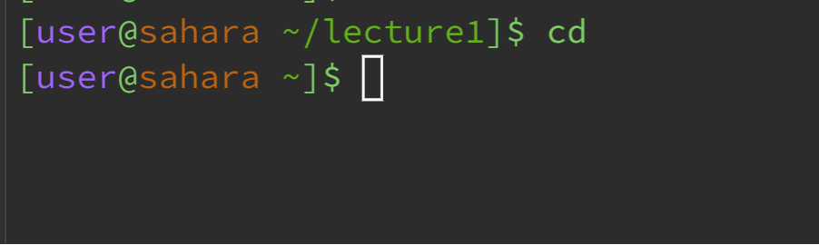
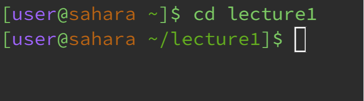
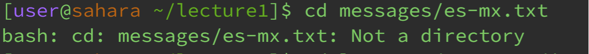
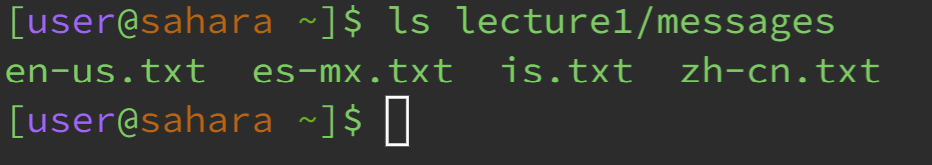
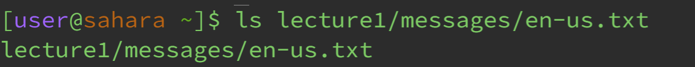
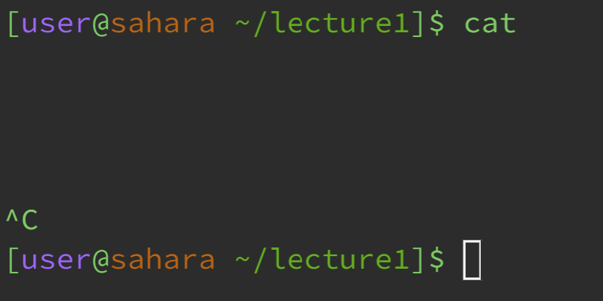
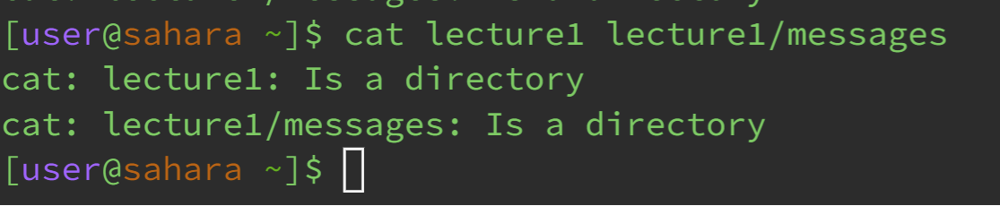
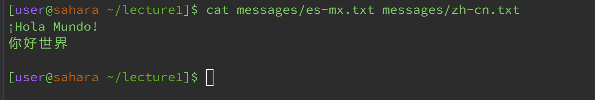

# Lab Report 1
---

**Command `cd`**

- No arguments:

Directory before running: `/home/lecture1`
Directory after running: `/home`

By running the command `cd` with no arguments while in the directory `/home/lecture1` we are returned to the home directory `/home`.
Running the command `cd` without any arguments changes the current directory to the parent directory. The lack of a direct output indicates
the command has run successfully and changed the current directory successfully, this is not an error.
  
- Path to a directory as an argument:

Directory before running: `/home`
Directory after running: `/home/lecture1`

By running the command `cd` with the argument `lecture1` from the `/home` directory, the current directory is changed from `/home` to `/home/lecture1`.
There is no directly given output after runnning this command, which indicates that the command was run successfully and thus that the current directroy was
changed successfully, this is not an error.
  
- Path to a file as an arguement:

Directory before running: `/home/lecture1`
Directory after running: `/home/lecture1`

By running the command `cd` with the argument `messages/es-mx.txt`, the output given is `bash: cd: messages/es-mx.txt: Not a directory`.
We can consider this an error, which is telling us that the path to the file `es-mx.txt` is an invalid directory to change to, or simply that it is
just not a directory. This error causes that specific output to be displayed because this text file cannot serve as a directory because it does not contain
other files.

**Command `ls`**

- No  arguments:

Directory before running: `/home/lecture1`
Directory after running: `/home/lecture1`

By running the command `ls` with no arguments while in the directory `/home/lecture1`, we get the output:
`Hello.class Hello.java messages README`
This output indicates the command executed successfully and that there was no error. This output lists all of the files and folders in in the current path.
Beacause the current directory is `/home/lecture1`, the command `ls` prints this output because all of these things are withing the `lecture1` folder.
  
- Path to a directory as an argument:

Directory before running: `/home`
Directory after running: `/home`

By running the command `ls` with the argument `lecture1/messages`, we get the output:
`en-us.txt es-mx.txt is.txt zh-cn.txt`
This output indicates that the command executed successfully and that there was no error. Once again, this output lists all of the files in given path,
and because the path takes us to the `messages` folder, all of the names of the text files within the `messages` folder are printed. 
  
- Path to a file as an argument:

Directory before running: `/home`
Directory after running: `/home`

By running the command `ls` with the argument `lecture1/messages/en-us.txt` we get the output:
`lecture1/messages/en-us.txt`
This output indicates once more that the command has executed successfully and that there was no error. The command `ls` lists all files and folders in a given
path, and the given path in this instance takes us to the the `en-us.txt' text file. Since this text file does not contain any other files or folders within itself, the path is returned without any other output, thus demonstrating that there are no other files or folders contained within the text file.

**Command `cat`**

- No arguments:

Directory before running: `/home/lecture1`
Directory after running: `/home/lecture1`

By running the command `cat` without any arguments, we essentially get no output. Instead, when the command is typed and we press enter, we get stuck in a constant loop of the terminal trying to take in user input, which we can exit out of by pressing Ctrl + c. This result that we get indicates an error, because while our command does run, it does not provide a correct output that we want when there are no arguments provided along with it. We would want it to print the contents of one or multiple files, but without the paths to these files as arguments for the command, this cannot happen, which causes the command to get stuck in a loop the way that it does.
  
- Path to a directory as an argument:

Directory before running: `/home`
Directory after running: `/home`

By running the command `cat` with the arguments `lecture1` and `lecture1/messages` (paths to directories) we get the output:
`cat: lecture1: Is a directory`
`cat: lecture1/messages: Is a directory`
This output indicates that there was an error when running the command with these arguments. The command `cat` is supposed to print the contents of files, thus the arguments are supposed to be paths to specific files, and these two arguments provided are only paths to directories, thus making the command `cat` unable to print anything from certain files. This error message tell us we have improper arguments/arguments of an incorrect type that do not allow the command to properly execute.
  
- Path to a file as an argument:

Directory before running: `/home/lecture1`
Directory after running: `/home/lecture1`

By running the command `cat` with the arguments `messages/es-mx.txt` and `messages/zh-cn.txt` we get the output:
`¡Hola Mundo!`
`你好世界`
This output indicates that there was no error when executing the command, and this is because the arguments that were provided are both proper/correct arguments in the sense that they are both valid paths to files (specifically text files) which contain contents that can be printed out. `cat` prints the outputs from each file provided by the paths, and in this instance it printed the text contents from both `es-mx.txt` and `zh-cn.txt` because the arguments provded were the paths to those files.

