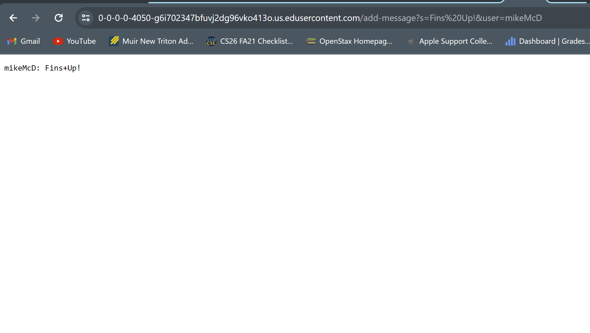
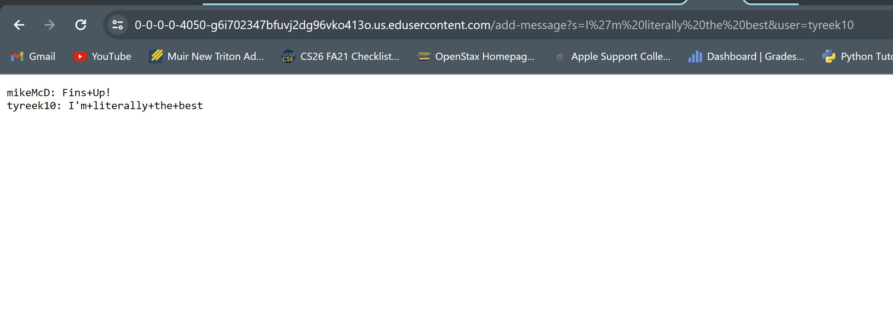
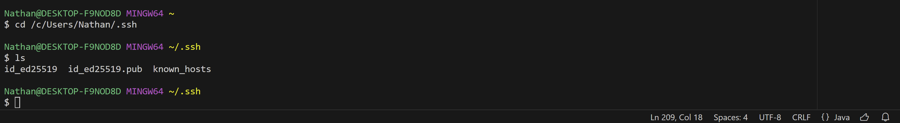
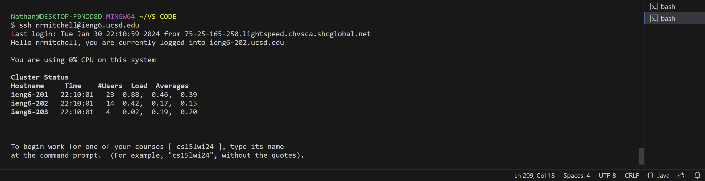

# Lab Report 2
---

PART 1

`ChatServer.java` Code
```
import java.io.IOException;
import java.net.URI;
import java.util.*;

class Handler implements URLHandler {
    // The one bit of state on the server: a number that will be manipulated by
    // various requests.

    String chat = "";

    public String handleRequest(URI url) {
        if (url.getPath().equals("/")) {
            return String.format(chat);
        } else {
            if (url.getPath().contains("/add-message")) {
                String[] parameters = url.getQuery().split("&");
                String message = parameters[0];
                message = message.substring(message.indexOf("=") + 1);

                String user = parameters[1];
                user = user.substring(user.indexOf("=") + 1);

                String fullString = String.format(user + ": " + message + "\n");

                chat = chat.concat(fullString);

                return chat;
            }
            return "404 Not Found!";
        }
    }
}

class ChatServer {
    public static void main(String[] args) throws IOException {
        if(args.length == 0){
            System.out.println("Missing port number! Try any number between 1024 to 49151");
            return;
        }

        int port = Integer.parseInt(args[0]);

        Server.start(port, new Handler());
    }
}
```

Example 1 of `/add-message`:



-Several methods are called in the code for Example 1, including the methods:
```
.contains()
.getQuery()
.split()
.substring()
.indexOf()
.format()
.concat()
```

- Relevant arguments for Example 1:
  1. for `.contains()` : the relevant arugement in .conatins() is `/add-message`
  2. for `.getQuery()` : the relevant argument is the `URI` variable `url` and it's associated value of the URL of the server page, which
                        in this instance would be the url query `/add-message?s=FINS UP!&user=mikeMcD`
  3. for `.split()` : there are two relevant arguements for this method, because it is used on two different occasions, once to
                      split the url query with the regular expression of `&` to seperate the strings `s=FINS UP!` and `user=mikeMcD` 
                      inputs in the query. It is used once more with the regular expression `=` to obtain the strings `FINS UP!` and
                      `mikeMcD` from the previous strings that were previoulsy separated by `&`.
  4. for `.substring()` : the relevant arguments for this method are `user.indexOf("=") + 1` and `message.indexOf("=") + 1`. These argumengts
                          essentially create the substrings that will be a part of the final output to be displayed on the server page. In this
                          instance, the substring method produces `mikeMcD` and `FINS UP!`.
  5. for `.indexOf()` : the relevant argument of this method, which is used twice, is `=`. This is utilized in combination wiht the substring method,
                        in order to access the index of `=` in the substrings provided by the `split` that was done prior. Getting the index of that
                        character in the string then allows us to split once again at that index, to get the pieces of the final output, in this case,
                        `FINS UP!` and `mikeMcD`.
  9. for `.format()` : the relevant arguments in this method are `chat` and `user + ": " + message + "\n"`. These arguments in the method allow us to
                       display the output to the server in the specific way as stated in the Lab Write Up, with the new line at the end, and the `: ` in
                       between the user and their message. 
  11. for `.concat()` : the relevant argument in this method is `fullString`, which is a reference to the properly formatted string output to be displayed
                        on the server page, in this case, `mikeMcD: FINS UP!`.

- As for the values of relevant fields, there are also various in Example 1:
  1. `url` changes form the original link `https://0-0-0-0-4050-5ol43auln2lm98699fsnnld814.us.edusercontent.com/` to the link with the added arguments, 
     now `https://0-0-0-0-4050-5ol43auln2lm98699fsnnld814.us.edusercontent.com/add-message?s=FINS%20UP!&user=mikeMcD`. 
  2. The string array parameters in this instance contains the elements `[s=FINS UP!]` and `[user=mikeMcD]`
  3. The string `message` is first set to `s=FINS UP!`, but then is set to be the substring `FINS UP!`.
  4. The string `user` is first set to be `user=mikeMcD`, but then is set to be the substring `mikeMcD`.
  5. The string `fullString` is set to be `mikeMcD: FINS UP!`.
  6. The string `chat` starts as an empty string `""` but then has `fullString` concatenated to it, making it `mikeMcD: FINS UP!`.


Example 2 of `/add-message`:



-Several methods are called in the code for Example 2, including the methods:
```
.contains()
.getQuery()
.split()
.substring()
.indexOf()
.format()
.concat()
```

- Relevant arguments for Example 2:
  1. for `.contains()` : the relevant arugement in .conatins() is `/add-message`
  2. for `.getQuery()` : the relevant argument is the `URI` variable `url` and it's associated value of the URL of the server page, which
                         in this instance would be the url query `/add-message?s=FINS UP!&user=mikeMcD`
  3. for `.split()` : there are two relevant arguements for this method, because it is used on two different occasions, once to
                      split the url query with the regular expression of `&` to seperate the strings `s=I'm literally the best` and `user=tyreek10` 
                      inputs in the query. It is used once more with the regular expression `=` to obtain the strings `I'm literally the best` and
                      `tyreek10` from the previous strings that were previoulsy separated by `&`.
  4. for `.substring()` : the relevant arguments for this method are `user.indexOf("=") + 1` and `message.indexOf("=") + 1`. These argumengts
                          essentially create the substrings that will be a part of the final output to be displayed on the server page. In this
                          instance, the substring method produces `tyreek10` and `I'm literally the best`.
  5. for `.indexOf()` : the relevant argument of this method, which is used twice, is `=`. This is utilized in combination wiht the substring method,
                        in order to access the index of `=` in the substrings provided by the `split` that was done prior. Getting the index of that
                        character in the string then allows us to split once again at that index, to get the pieces of the final output, in this case,
                        `I'm literally the best` and `tyreek10`.
  9. for `.format()` : the relevant arguments in this method are `chat` and `user + ": " + message + "\n"`. These arguments in the method allow us to
                       display the output to the server in the specific way as stated in the Lab Write Up, with the new line at the end, and the `: ` in
                       between the user and their message. 
  11. for `.concat()` : the relevant argument in this method is `fullString`, which is a reference to the properly formatted string output to be displayed
                        on the server page, in this case, `tyreek10: I'm literally the best`.

- As for the values of relevant fields, there are also various in Example 2:
  1. `url` changes form the original link `https://0-0-0-0-4050-5ol43auln2lm98699fsnnld814.us.edusercontent.com/` to the link with the added arguments,
      now `https://0-0-0-0-4050-5ol43auln2lm98699fsnnld814.us.edusercontent.com/add-message?s=I%27m%20literally%20the%20best&user=tyreek10`. 
  2. The string array parameters in this instance contains the elements `[s=I'm literally the best]` and `[user=tyreek10]`
  3. The string `message` is first set to `s=I'm literally the best`, but then is set to be the substring `I'm literally the best`.
  4. The string `user` is first set to be `user=tyreek10`, but then is set to be the substring `tyreek10`.
  5. The string `fullString` is set to be `tyreek10: I'm literally the best`.
  6. The string `chat` starts as an empty string `""` but then has `fullString` concatenated to it, making it `tyreek10: I'm literally the best`.


 PART 2

- `ls` showing absolute paths for private and public keys

  
  

  The absolute path for the public key is `/~/.ssh/authorized_keys` or `/home/linux/ieng6/oce/24/nrmitchell/.ssh/authorized_keys`
  The absolute path for the private key is `/c/Users/Nathan/.ssh/id_ed25519`

- Terminal interaction: login without being asked for password
  

  After running the command `ssh nrmitchell@ieng6.ucsd.edu` I was able to login and connect to my account
  without having to input my password.

  PART 3

  I learned a lot of new things in labs 2 and 3 mostly about running servers and also about URLs. I learned how to run a seemingly very basic server from my own
  computer. I learned that it doesn't take nearly as much code as I first believed it did to make that happen. Additionally, in working with such servers I learned that
  we can manipulate URLs in certain ways (such as by directly putting arguments into URLs) in order to directly change the appearance/output of a server or a site. Another
  really interesting thing I learned about is the SSH keys. Although I am still learning about them, working with them in the way we have in this lab has been very interesting.
  I learned that these public and private SSH keys can be saved to their own locations on a device, can be accessed similarly to how we would access other files or directories,
  and can be shared to other places all through the terminal/command line. Finally, I learned how to work with new commands such as `scp` and `mkdir`. The `scp` command is a secure
  copying or transferring of files between locations, and the `mkdir` command, seemingly self-explanatory, is a command that allows you to make a new directory.
  
 
