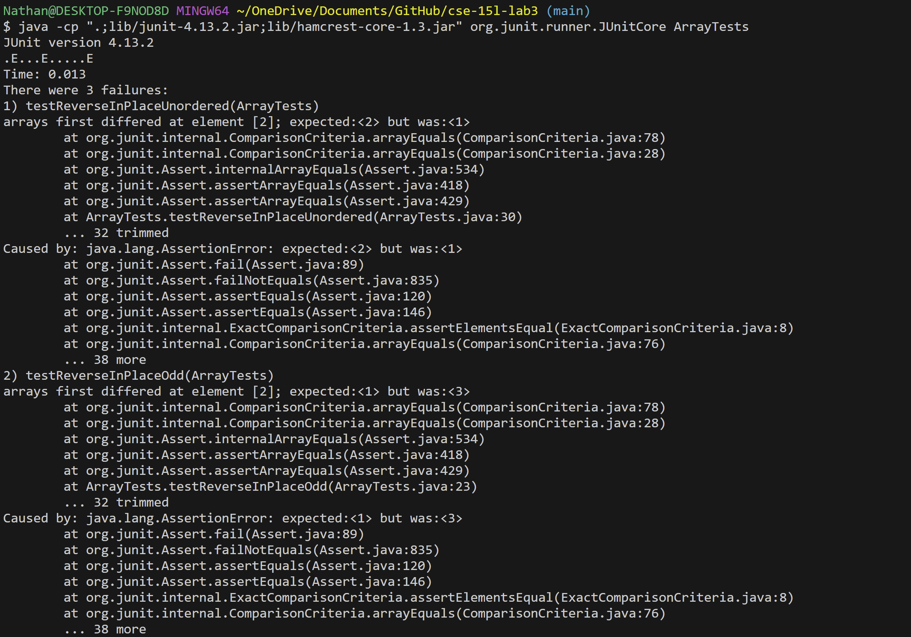
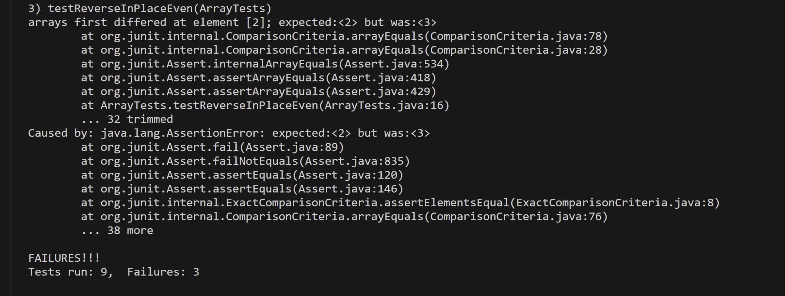

# Lab Report 3
---
## Part 1 - Bugs

- Failure inducing input for the buggy program:
  ```
  @Test
  public void testReverseInPlaceEven(){
    int[] input1 = { 1, 2, 3, 4 };
    ArrayExamples.reverseinPlace(input1);
    assertArrayEquals(new int[]{ 4, 3, 2, 1 }, input1);
  }
  ```

- Input that doesn't induce failure:
  ```
  @Test 
	public void testReverseInPlaceSingle() {
    int[] input1 = { 3 };
    ArrayExamples.reverseInPlace(input1);
    assertArrayEquals(new int[]{ 3 }, input1);
	}
  ```

- Symptom (Output of the running tests):
  
  

- The bug (before and after code):
  - BEFORE:
    ```
    // Changes the input array to be in reversed order
    static void reverseInPlace(int[] arr) {
      for(int i = 0; i < arr.length; i += 1) {
        arr[i] = arr[arr.length - i - 1];
      }
    }
    ```
 
  - AFTER:
    ```
    // Changes the input array to be in reversed order
    static void reverseInPlace(int[] arr) {
      for(int i = 0; i < arr.length / 2; i += 1) {
        int temp = arr[i];
        arr[i] = arr[arr.length - i - 1];
        arr[arr.length - i - 1] = temp;
      }
    }
    ```

- This fixes the program because before, there was no temp variable that allowed us to store the old elements of the array in order to
  place them in the appropriate indices of the array all the way through. Furthermore, we only iterate halfway through the length of the array
  in the `for ` loop (`arr/length / 2`), in order to preserve the other elements of the original array, and not lose them while iterating.

## Part 2 - Researching Commands

1. Command `grep -c`
   - Example 1
     ```
     $ grep -c "cell" 1471-213X-1-3.txt
     102
     ```
     In Example 1, `grep -c` is counting all lines in the file `1471-213X-1-3.txt` that contain the string `"cell"` and returning
     that total number of lines as the output. This is useful because it helps determine if this file is related to/relevant to
     cells and can help determine whether this file has relevant/useful amounts of information.
     
  
   - Example 2
     ```
     $ grep -c "the" 1471-213X-1-3.txt
     331
     ```
     In Example 2, `grep -c` is counting all lines in the file `1471-213X-1-3.txt` that contain the string `"the"` and returning
     that total number of lines as the output. For this specific word "the", this search is not necessarily as useful but does give
     some indication as to the length/wordiness of the text file as well.

     The command `grep -c` gives the number of lines in the given file/files that contain the regular expression (the given string), it
     returns the total number of lines that contain the string, which can be useful for narrowing the search for certain terms or files and
     can give a sense about how relevant the text in those files are to the term given the number that is returned.

     Source: [grep command in Unix/Linux](https://www.geeksforgeeks.org/grep-command-in-unixlinux/)
     

2. Command `grep -i`
   - Example 1
     ```
      $ grep -i "CeLlS" 1471-213X-1-3.txt
        cells and a Schlemm's canal (SC). The aqueous percolates
        development of this ocular region. Cells of the periocular
        cranial paraxial mesoderm-derived cells in this tissue.
        After the migrating mesenchymal cells reach the anterior
        mesenchymal cells. As TM development proceeds the cellular
        trabecular cells and the cores of the beams are composed of
        others propose a reorganization of cells with no cell death
          cells were present adjacent to the anterior margin of the
          and ciliary body. At this time, progenitor cells of the
          had produced a loosely arranged cluster of cells that was
          several cells thick and extended from the anterior edge
          retina. These cells were characterized by plump oval
          surface and the angle mesenchyme because the cells
          more densely packed and the cells and their nuclei were
          evidenced by the fact that some of the cells destined to
          developed. Pigmented cells and blood vessels were clearly
          aggregation of cells with densely stained, plump fusiform
          ciliary body by P8. These cells were less densely packed
          age, the anterior cells of the future TM had begun to
          separate, although the posterior cells remained closely
          cells (Figure 5D) located near the inner wall of SC close
          endothelial cells and at low power several giant vacuoles
          did not identify dead or pyknotic cells at any age from
          to demonstrate any cells that had necrotic or apoptotic
          YOYO-1. Cells were identified as apoptotic only when they
          labeled cells were identified in the angles of
          120,000 analyzed TM and SC cells. One of these positive
          cells was located in the lumen of Schlemm's canal and was
          likely a blood cell. No apoptotic cells were detected in
          ganglion cells (Figure 6) were frequently identified
          (often 2 or more apoptotic cells in a section) during the
          abundant apoptotic cells were always detected.
          cells [ 29, 30]. We assessed five mice of each of the
          differentiation of cells, differential growth rates of
          cells, modulation of the extracellular matrix, and cell
          In Sprague Dawley (SD) rats, dying cells were readily
          cells per section) and less abundantly at older adult
          this and the fact that dying cells were identified in the
          routes. The dying cells were frequently associated with
          death of vascular endothelial cells during programmed
          number of cells increased as the TM matured. Macrophages
          TM of B6 and A.BY/SnJ mice. Dying cells were not detected
          cells with the characteristic morphologic changes of
          only 2 apoptotic cells were detected in the developing
          In contrast, apoptotic cells were frequently identified
          kill TM cells [ 30] is not required for TM channel
          associated with dying cells in the iris, ciliary body and
          that considering all ages there was on average 100 cells
          approximately 120,000 developing TM and SC cells (100
          cells X 600 sections X 2 angle regions per section). A
          analyzed with a confocal microscope and cells were
     ```
     In Example 1, `grep -i` is searching the file `1471-213X-1-3.txt` for the given string `"CeLls"`, but is doing so without
     any sensitivity to the combination of lower and upper case within the given string, and returns every line that contains the
     given string from the file. This is useful because it gives insight to potentially useful information in the file that is relevant
     to the user's search via the given string.
  
   - Example 2
     ```
     $ grep -i "cELLs" 1471-213X-1-3.txt
        cells and a Schlemm's canal (SC). The aqueous percolates
        development of this ocular region. Cells of the periocular
        cranial paraxial mesoderm-derived cells in this tissue.
        After the migrating mesenchymal cells reach the anterior
        mesenchymal cells. As TM development proceeds the cellular
        trabecular cells and the cores of the beams are composed of
        others propose a reorganization of cells with no cell death
          cells were present adjacent to the anterior margin of the
          and ciliary body. At this time, progenitor cells of the
          had produced a loosely arranged cluster of cells that was
          several cells thick and extended from the anterior edge
          retina. These cells were characterized by plump oval
          surface and the angle mesenchyme because the cells
          more densely packed and the cells and their nuclei were
          evidenced by the fact that some of the cells destined to
          developed. Pigmented cells and blood vessels were clearly
          aggregation of cells with densely stained, plump fusiform
          ciliary body by P8. These cells were less densely packed
          age, the anterior cells of the future TM had begun to
          separate, although the posterior cells remained closely
          cells (Figure 5D) located near the inner wall of SC close
          endothelial cells and at low power several giant vacuoles
          did not identify dead or pyknotic cells at any age from
          to demonstrate any cells that had necrotic or apoptotic
          YOYO-1. Cells were identified as apoptotic only when they
          labeled cells were identified in the angles of
          120,000 analyzed TM and SC cells. One of these positive
          cells was located in the lumen of Schlemm's canal and was
          likely a blood cell. No apoptotic cells were detected in
          ganglion cells (Figure 6) were frequently identified
          (often 2 or more apoptotic cells in a section) during the
          abundant apoptotic cells were always detected.
          cells [ 29, 30]. We assessed five mice of each of the
          differentiation of cells, differential growth rates of
          cells, modulation of the extracellular matrix, and cell
          In Sprague Dawley (SD) rats, dying cells were readily
          cells per section) and less abundantly at older adult
          this and the fact that dying cells were identified in the
          routes. The dying cells were frequently associated with
          death of vascular endothelial cells during programmed
          number of cells increased as the TM matured. Macrophages
          TM of B6 and A.BY/SnJ mice. Dying cells were not detected
          cells with the characteristic morphologic changes of
          only 2 apoptotic cells were detected in the developing
          In contrast, apoptotic cells were frequently identified
          kill TM cells [ 30] is not required for TM channel
          associated with dying cells in the iris, ciliary body and
          that considering all ages there was on average 100 cells
          approximately 120,000 developing TM and SC cells (100
          cells X 600 sections X 2 angle regions per section). A
          analyzed with a confocal microscope and cells were
     ```
     In Example 2, `grep -i` is searching the file `1471-213X-1-3.txt` for the given string `"cELLs"`, but is doing so without
     any sensitivity to the combination of lower and upper case within the given string, and returns every line that contains the
     given string from the file. Once again, this is useful because it gives insight to potentially useful information in the file that is relevant
     to the user's search via the given string. It is important to note this gives the same output as Example 1, because there is no case sensitivity
     when using `grep -i`.
     
     The command `grep -i` enables us to search the a file/files for a given string regular expression insensitively to cases (upper and lower case).
     This command is useful because when looking for a particular regular expression, being able to search for out without having to worry about errors
     or differences in the spelling related to lower and upper case makes the search and finding of results much easier.

     Source: [grep command in Unix/Linux](https://www.geeksforgeeks.org/grep-command-in-unixlinux/)

3. Command `grep -n`
   - Example 1
     ```
     $ grep -n "legal" agency_expands.txt
     10:legal services to the poor, has expanded into the San Gabriel and
     23:From simple telephone advice to complete legal representation in
     25:immigration, housing, public benefits and labor legal services to
     31:the legal offices who spoke Spanish," Dudovitz said. "Now Spanish
     51:funds providers of free legal services nationwide, reduced the
     ```
     In Example 1, `grep -n` is searching the file `agency_expands.txt` for the given string `"legal"` and is outputting
     all lines that contain the given string matched with their line numbers in the given file. This is useful because it provides
     a lot of useful information realted to the search term (the given string) along with where specifically to locate it within
     the file, making it easy to find.
  
   - Example 2
     ```
     $ grep -n "services" agency_expands.txt
     5:Legal services agency expands
     10:legal services to the poor, has expanded into the San Gabriel and
     18:U.S. living below the poverty line, NLS services are badly needed,
     22:services and programs available to the poor," he said.
     25:immigration, housing, public benefits and labor legal services to
     51:funds providers of free legal services nationwide, reduced the
     ```
     In Example 2, `grep -n` is searching the file `agency_expands.txt` for the given string `"services"` and is outputting
     all lines that contain the given string matched with their line numbers in the given file. Again, this is useful because it provides
     a lot of useful information realted to the search term (the given string) along with where specifically to locate it within
     the file, making it easy to find.

     The command `grep -n` outputs all line numbers of the file that contain the given regular expression string and also matches those line numbers with
     each of their respective lines. That is, this command returns each of the line numbers and the full lines that contain the given regular expression
     within a file. This is especially useful becasue not only does it provide the full lines, but makes them all much easier to locate because it gives the mathcing
     line number right next to each line. It makes things much easier to read and find.

     Source: [grep command in Unix/Linux](https://www.geeksforgeeks.org/grep-command-in-unixlinux/)

4. Command `grep -l`
   - Example 1
     ```
     $ grep -l "law" *.txt
     Cohenetal_comparison.txt
     Cohenetal_CreamSkimming.txt
     Cohenetal_DeliveryCost.txt
     Cohenetal_Scale.txt
     Gleiman_EMASpeech.txt
     Gleiman_gca2000.txt
     Mitchell_RMVancouver.txt
     Redacted_Study.txt
     ReportToCongress2002WEB.txt
     ```
     In Example 1, the command `grep -l` searches the current directory for all text files that contain the given string `"law"`
     and returns the names of all files that contain that string. This is useful because it allows the user to better narrow their search
     to the files that are output because they are most likely to be relevant to their search.
  
   - Example 2
     ```
     $ grep -l "city" *.txt
     Cohenetal_comparison.txt
     Cohenetal_Cost_Function.txt
     Cohenetal_CreamSkimming.txt
     Cohenetal_DeliveryCost.txt
     Cohenetal_RuralDelivery.txt
     Cohenetal_Scale.txt
     Gleiman_gca2000.txt
     Mitchell_6-17-Mit.txt
     Mitchell_RMVancouver.txt
     Mitchell_spyros-first-class.txt
     Redacted_Study.txt
     WolakSpeech_usps.txt
     ```
     In Example 2, the command `grep -l` searches the current directory for all text files that contain the given string `"city"`
     and returns the names of all files that contain that string. Again, this is useful because it allows the user to better narrow their search
     to the files that are output because they are most likely to be relevant to their search.
     
     The command `grep -l` outputs the names of all the files that contain the given regular expression string. This is useful because
     it provides an instant way to know all of the files that contain the given expression, and provides a fast way to know which
     files are useful/relevant to your search.

     Source: [grep command in Unix/Linux](https://www.geeksforgeeks.org/grep-command-in-unixlinux/)
