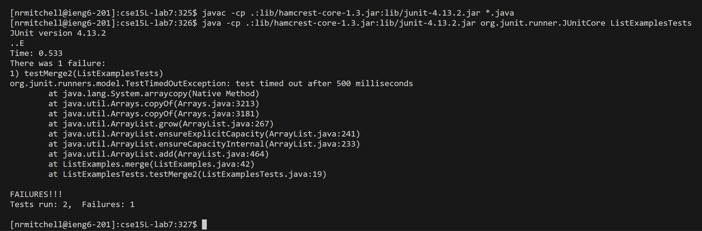
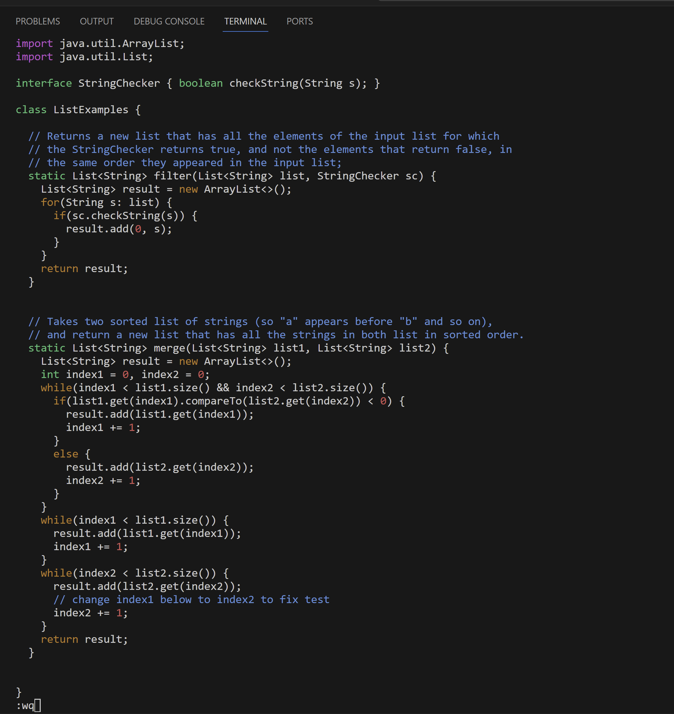

# Lab Report 4
---
## Step 4: Log into ieng6
  - Keys pressed: `<up><up<up><up><enter>`
  - the `ssh nrmitchell@ieng6.ucsd.edu` command was 4 up in the search history, so I used the up arrow to access it.

    

## Step 5: Clone fork of the repository from Github (using ssh)
  - Keys pressed: `git <space> clone <space><Ctrl + V><enter>`
  - I typed out the command `git clone` and then pasted the SSH link git@github.com:nathan-rob-mitchell/cse15L-lab7.git`
    into the commmand line, then I pressed `<enter>` to run the command.

    

## Step 6: Run the tests, demonstrating they fail
  - Keys pressed: `<Ctrl + V><enter><Ctrl + V><space> ListExamplesTests <enter>`
  - I copied and pasted the command `javac -cp .:lib/hamcrest-core-1.3.jar:lib/junit-4.13.2.jar *.java` and then pressed `<enter>`
    and then copied and pasted the command `cse15L-lab7:326$ java -cp .:lib/hamcrest-core-1.3.jar:lib/junit-4.13.2.jar org.junit.runner.JUnitCore`
    to which I added `ListExamplesTests` in order to run the tests in `ListExamplesTests.java`.

    

## Step 7: Edit code file to fix the failing tests
  - Keys pressed: `vim ListExamples.java <enter>`
                  `/index1 <enter><shift + N><e><x><i> 2 <esc> :wq <enter>`
  - I used the `vim` command to make the edit in `ListExamples.java`. Once in `vim`, I used `/index1` in order to search
    for the phrase `index1` in order to quickly locate all places where the phrase `index1` exists in the file. Then I used
    `shift + N` to go to the last `index1` phrase in the file, where we need to change `index1` to `index2`. Then I used `e` to
    go to the end of that last phrase `index1`, placing the cursor at the `1` character. Then I pressed `x` in order to remove
    the `1` at the end of `index1`, and then `i` in order to go into Insert Mode, and then I pressed `2`, changing `index1` to
    `index2`. The I pressed `<esc>` to return to Normal Mode, and then saved the changes and quit vim using `:wq <enter>`.

    
    

## Step 8: Run the tests, demonstrating they now succeed
  - Keys pressed: `<up><up><up><enter>`
                  `<up><up><up><enter>`
  - In order to run the tests again, I used the `<up>` arrow key in order to search the history to find and run the commands
    `javac -cp .:lib/hamcrest-core-1.3.jar:lib/junit-4.13.2.jar *.java` and
    `java -cp .:lib/hamcrest-core-1.3.jar:lib/junit-4.13.2.jar org.junit.runner.JUnitCore ListExamplesTests`.

     

## Step 9: Commit and push resulting change to Github
  - Keys pressed: `git add ListExamples.java <enter>`
                  `git commit <enter>`
                  `changed index1 to index2 in ListExamples.java <esc> :wq <enter>`
                  `git push`
  - I used `git add` to stage the change that was made to `ListExamples.java`. Then I used `git commit` to save fully commit/save the
    changes that were staged with `git add`. I entered the commit message `chnaged index1 to index2 in ListExamples.java` and used `:wq`
    to save the commit message. Finally, I used `git push` to update the repository in Github with the changes made.

    
    
    
